# AI Interview Question Generator

## 📌 Project Overview
The AI Interview Question Generator is a full-stack web application designed to help candidates prepare for technical and HR interviews. It allows users to generate tailored, high-frequency interview questions dynamically categorized by technology, job role, experience level, and difficulty. Users can practice coding, SQL, HR, aptitude, and core technical questions, while bookmarking their favorites for a personalized revision library.

## 🚀 Technology Stack
**Frontend:**
* React.js (Vite)
* Tailwind CSS (Custom glassmorphism design)
* Lucide React (Icons)
* React Router DOM (Protected routing)

**Backend:**
* Java 17+
* Spring Boot 3
* Spring Security (JWT-based Authentication)
* Spring Data JPA (Hibernate)

**Database:**
* MySQL

## 🛠️ Setup Instructions

### Prerequisites
* Java 17 or higher installed
* Node.js (v18+) installed
* MySQL Server (running locally)

### 1. Database Configuration
Ensure your local MySQL server is running on port `3306`.
The application is configured to automatically create the database if it doesn't exist.
If your MySQL credentials differ, update them in `backend/src/main/resources/application.yml`:
```yaml
spring:
  datasource:
    url: jdbc:mysql://localhost:3306/interview_generator?createDatabaseIfNotExist=true&useSSL=false&allowPublicKeyRetrieval=true&serverTimezone=UTC
    username: root
    password: localhost # Update this if your local password is different
```

### 2. Backend Setup
Navigate to the backend directory:
```bash
cd backend
```
Run the Spring Boot application using the Maven wrapper:
```bash
./mvnw clean spring-boot:run
```
*(The backend will start on `http://localhost:8080`. On its first run, a `DataSeeder` will automatically populate the database with experience levels, categories, technologies, job roles, and over 40 sample questions).*

### 3. Frontend Setup
Open a new terminal and navigate to the frontend directory:
```bash
cd frontend
```
Install the Node dependencies:
```bash
npm install
```
Start the Vite development server:
```bash
npm run dev
```
*(The frontend will be accessible at `http://localhost:3000`).*

## 🔑 Key API Endpoints

### Authentication (`/api/auth`)
* `POST /register` - Register a new user account (hashes password via BCrypt)
* `POST /login` - Authenticate a user and return a JWT access token

### Questions (`/api/questions`)
* `GET /` - Fetch questions (Supports filtering by `technology`, `jobRole`, `experienceLevel`, `category`, `difficulty`)
* `GET /{id}` - Get a specific question by ID
* `POST /` - Create a new question (Admin only)
* `GET /favorites` - Retrieve the authenticated user's bookmarked questions
* `POST /{id}/favorite` - Toggle a question in the user's favorites list

### Metadata Endpoints (`/api/*`)
* `GET /api/technologies` - List all supported tech stacks
* `GET /api/job-roles` - List available job roles
* `GET /api/categories` - List main question categories
* `GET /api/experience-levels` - List experience tiers

## 📸 Application Screenshots

*(Note: Make sure this `Screenshots` folder is committed to your GitHub repository so the images load correctly!)*

### Pages & User Interface
* **Home Page:** 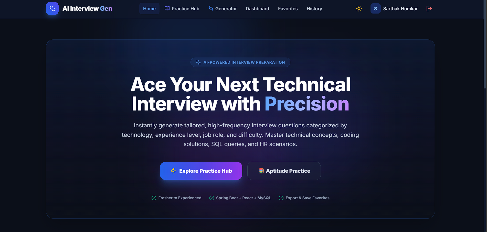
* **Login Page:** 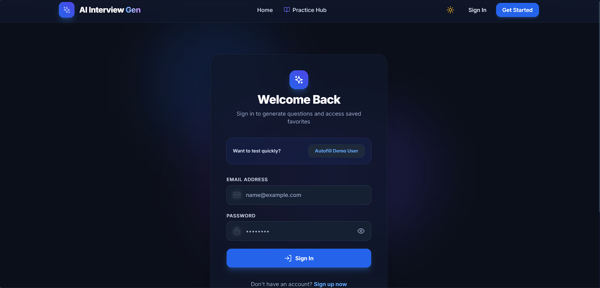
* **Sign Up Page:** 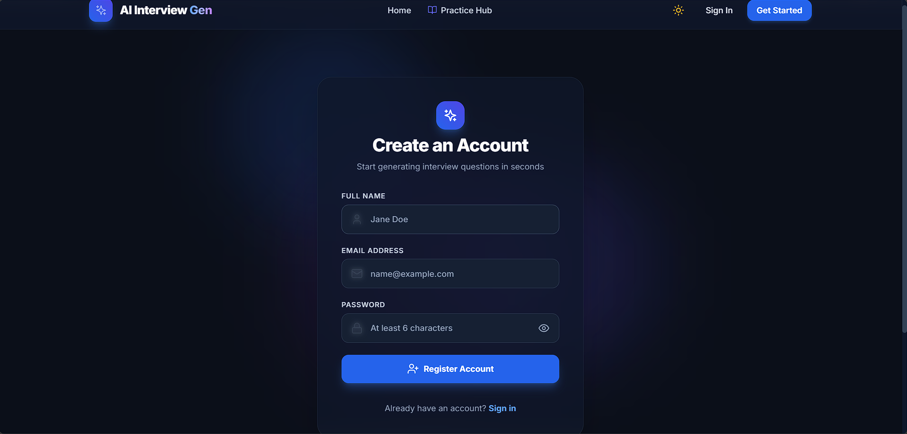

### Question Generation & Dashboard
* **Generate Questions Filter:** 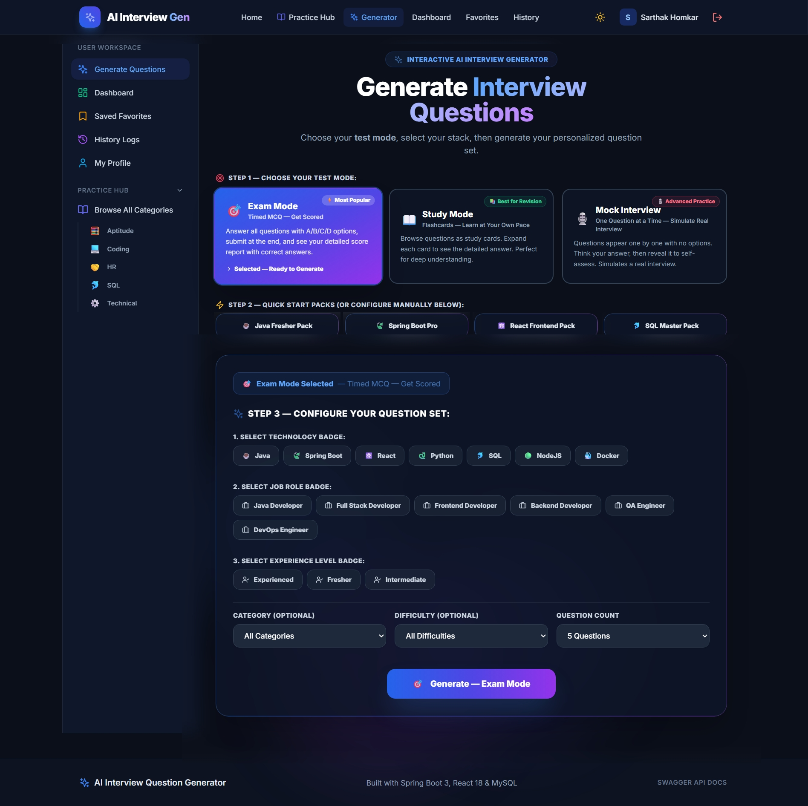
* **Question Format / UI:** 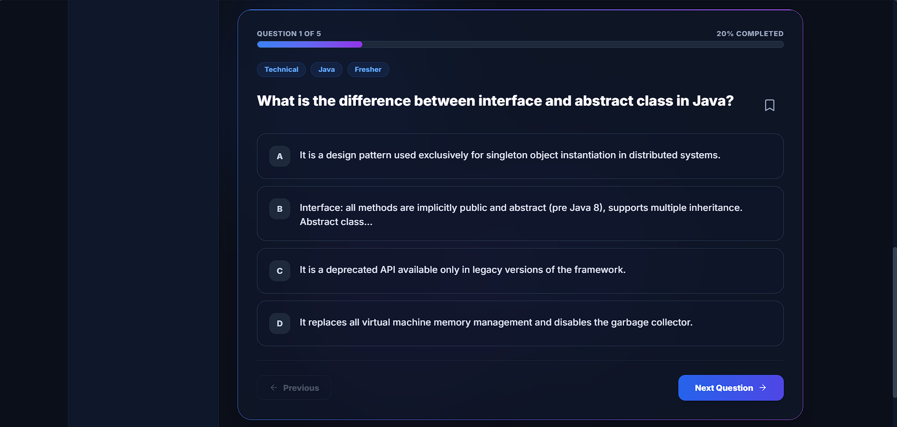
* **Result Format:** 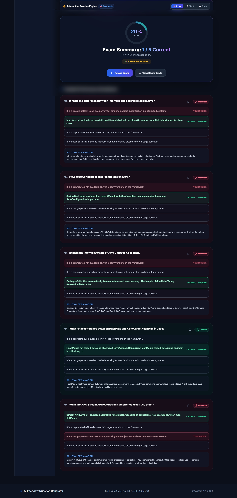

### Practice Categories
* **Technical Questions:** 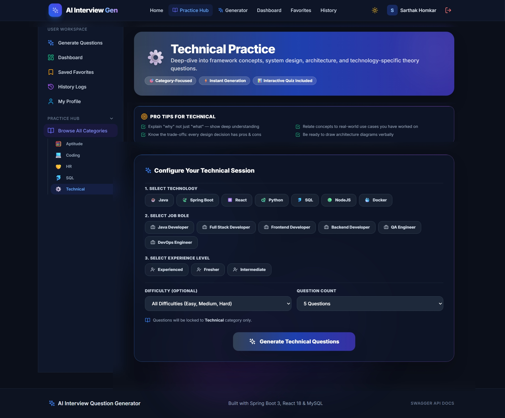
* **Coding Questions:** 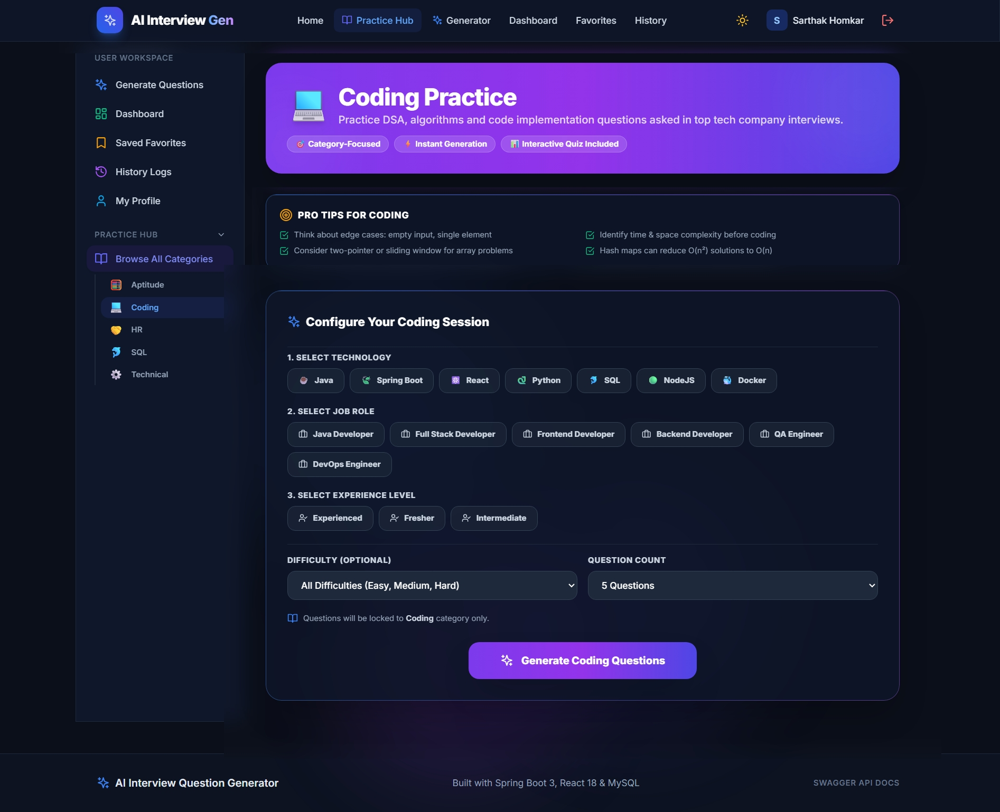
* **SQL Questions:** 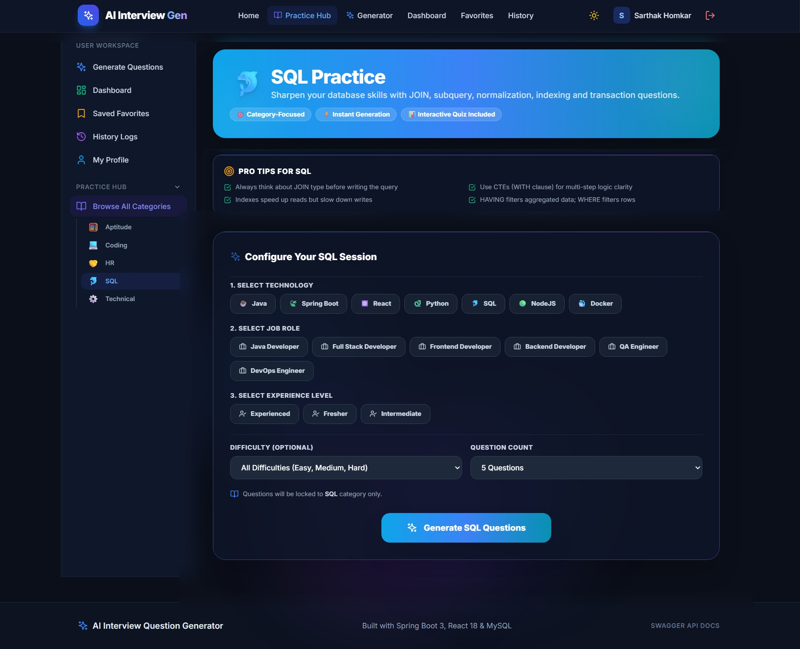
* **HR Questions:** 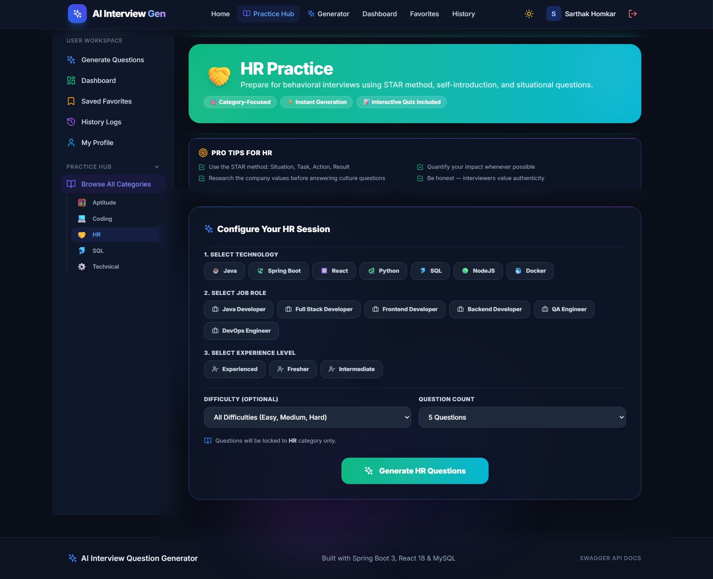
* **Aptitude Questions:** 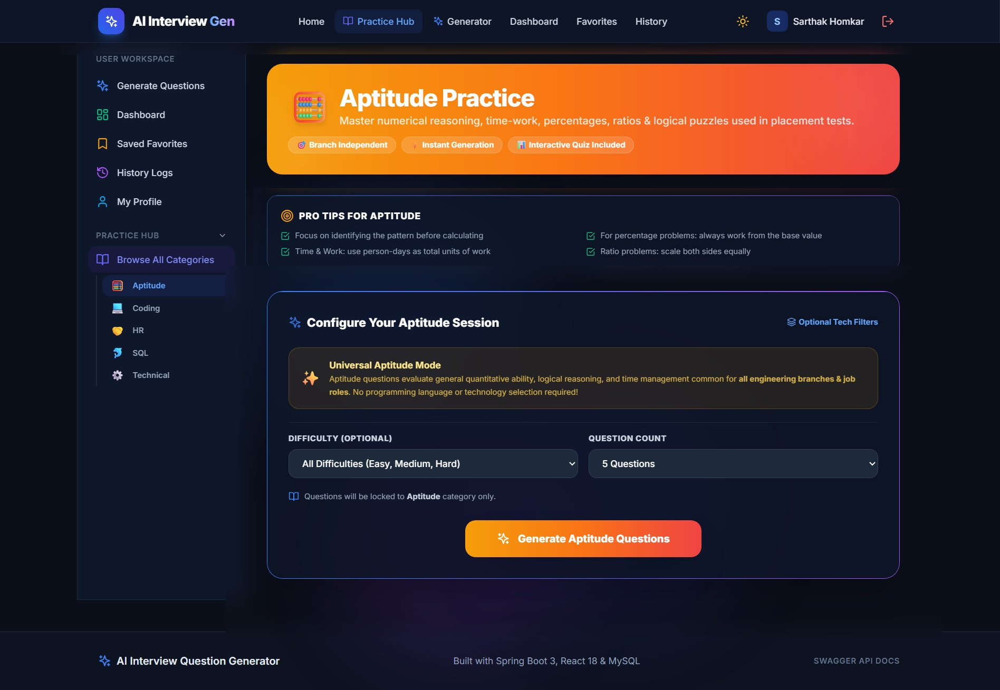

### User Workspace
* **Saved Favorites:** 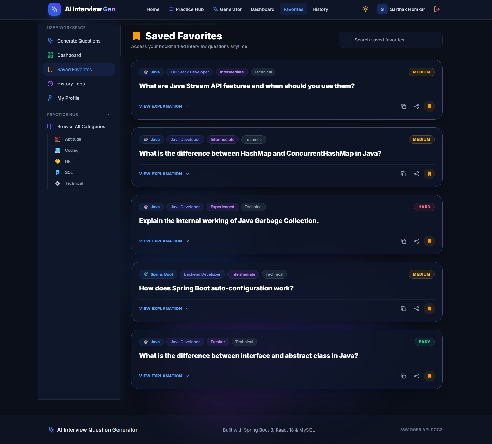
* **History Logs:** 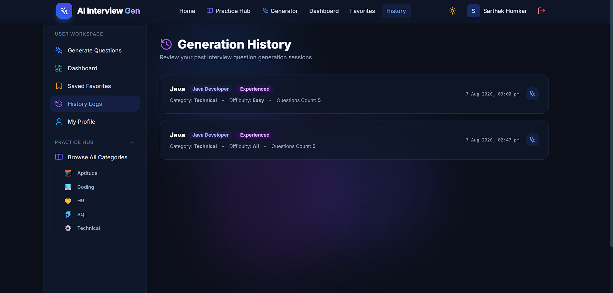
